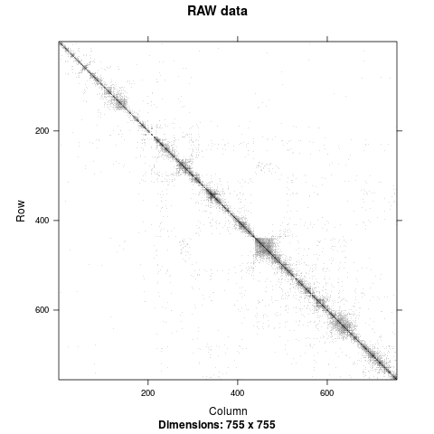
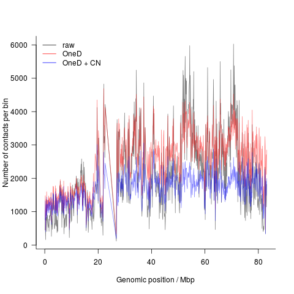

# dryhic

## Overview

dryhic is a set of tools to manipulate HiC data.

## Installation

You can install the package using the handy `devtools::install_github`. It's highly recommended to install also the accompanying [dryhicdata](https://github.com/qenvio/dryhicdata) package, containing some useful data.

``` r

devtools::install_packages("qenvio/dryhic")
devtools::install_packages("qenvio/dryhicdata")

```

Alternatively, you can download, unzip and install the package manually (only UNIX)

``` sh

wget https://github.com/qenvio/dryhic/archive/master.zip
unzip master.zip
mv dryhic-master dryhic
sudo R CMD INSTALL dryhic

rm master.zip

wget https://github.com/qenvio/dryhicdata/archive/master.zip
unzip master.zip
mv dryhicdata-master dryhicdata
sudo R CMD INSTALL dryhicdata

```


## Usage

### Get the data

First of all, we load the packages and some data


``` r

# dependencies

library("dplyr")
library("Matrix")
library("mgcv")

library("dryhic")
library("dryhicdata")

# load a sample matrix

data(mat)

str(mat)

```

By definition, a HiC contact matrix is symmetrical, so the object stores only the upper diagonal. We can symmetrize it easily

``` r

mat[1:10, 1:10]

mat <- symmetrize_matrix(mat)

mat[1:10, 1:10]

```

Besides the contact matrix itself, we need also some genomic information

``` r

# load some genomic information

data(bias_hg38)
data(enzymes_hg38)

str(bias_hg38)
str(enzymes_hg38)

```

The experiment was performed using HindIII restriction enzyme, so we gather this information

``` r

# get genomic information

info <- mutate(enzymes_hg38,
               res = HindIII) %>%
        select(chr, pos, res) %>%
		inner_join(bias_hg38) %>%
		mutate(bin = paste0(chr, ":", pos))

summary(info)

```

As a sanity check, we should be sure that both the contact matrix and the genomic information refer to the very same genomic loci

``` r

common_bins <- intersect(info$bin, rownames(mat))

# watch out! this step orders chromosomes alphabetically

info <- filter(info, bin %in% common_bins) %>%
        arrange(chr, pos)

i <- match(info$bin, rownames(mat))

mat <- mat[i, i]

```

Now we can compute the total coverage per bin and the proportion of non-zero entries

``` r

info$tot <- Matrix::rowSums(mat)
info$nozero <- Matrix::rowMeans(mat != 0)

```

### Filter out problematic bins

Some loci in the genome have a very poor coverage. We can filter them out based both on the HiC matrix (namely, all bins without any coverage and those presenting a very high proportion of void cells). We can further filter out bins with low mappability and with no restriction enzyme sites.

``` r

info <- filter(info,
               map > .5,
			   res > 0,
			   tot > 0,
			   nozero > .05 * median(nozero))

i <- match(info$bin, rownames(mat))

mat <- mat[i, i]

```

### Graphical representation

In order to have a look at the data, we can select a region and create a contact map.

``` r

bw <- colorRampPalette(c("white", "black"))

bins_chr17 <- which(info$chr == "chr17")

mat_chr17 <- mat[bins_chr17, bins_chr17]

logfinite(mat_chr17) %>% image(useRaster = TRUE, main = "RAW data",
                               col.regions = bw(256), colorkey = FALSE)

```



### Bias removal

We can apply the ICE bias correction

``` r

mat_ice <- ICE(mat, 30)

ice_chr17 <- mat_ice[bins_chr17, bins_chr17]

logfinite(ice_chr17) %>% image(useRaster = TRUE, main = "ICE",
                               col.regions = bw(256), colorkey = FALSE)

```


Or we can apply oned correction

``` r

info$oned <- oned(info)

mat_oned <- correct_mat_from_b(mat, info$oned)

oned_chr17 <- mat_oned[bins_chr17, bins_chr17]

logfinite(oned_chr17) %>% image(useRaster = TRUE, main = "oned",
                                col.regions = bw(256), colorkey = FALSE)


```


### Copy number estimation

Once OneD bias removal has been applies, we can uset this result to estimate the
number of copies

``` r

# get total number of bias-corrected contacts per bin

info$tot_oned <- rowSums(mat_oned)[info$bin]

# estimate CN 

info$cn <- fitcnv(info$tot_oned)[[2]]

# apply correction (the 1 / 2 factor is applied because most of the genome is diploid)

mat_onedcn <- correct_mat_from_b(mat_oned, sqrt(info$cn / 2))
info$tot_onedcn <- rowSums(mat_onedcn)[info$bin]


```

We can plot the total number of contacts per bin to check bias removal and CN
normalization

``` r


with(info[bins_chr17,], plot(pos / 1e6, tot,
                             type = "l", las = 1, col = rgb(0, 0, 0, .5),
							 bty = "l",
							 xlab = "Genomic position / Mbp",
							 ylab = "Number of contacts per bin"))

with(info[bins_chr17,], lines(pos / 1e6, tot_oned,
                              col = rgb(1, 0, 0, .5)))

with(info[bins_chr17,], lines(pos / 1e6, tot_onedcn,
                              col = rgb(0, 0, 1, .5)))

legend("topleft", legend = c("raw", "OneD", "OneD + CN"), lty = 1,
       col = c("black", "red", "blue"), bty = "n")


```


