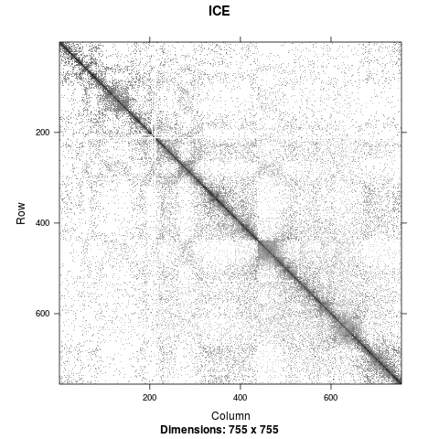

# dryhic

## Overview

dryhic is a set of tools to manipulate HiC data.

## Installation

You can install the package using the handy `devtools::install_github`. It's highly recommended to install also the accompaining [dryhicdata](https://github.com/qenvio/dryhicdata) package, containing some useful data.

``` r

devtools::install_packages("qenvio/dryhic")
devtools::install_packages("qenvio/dryhicdata")

```

## Usage

### Get the data

First of all, we load the packages and some data


``` r

# dependencies

library("dplyr")
library("Matrix")
library("mgcv")

library("dryhic")
library("dryhicdata")

# load a sample matrix

data(mat)

str(mat)

```

By definition, a HiC contact matrix is symmetrical, so the object stores only the upper diagonal. We can symmetrize it easily

``` r

mat[1:10, 1:10]

mat <- symmetrize_matrix(mat)

mat[1:10, 1:10]

```

Besides the contact matrix itself, we need also some genomic information

``` r

# load some genomic information

data(bias_hg38)
data(enzymes_hg38)

str(bias_hg38)
str(enzymes_hg38)

```

The experiment was performed using HindIII restrinction enzyme, so we gather this information

``` r

# get genomic information

info <- mutate(enzymes_hg38,
			   res = HindIII) %>%
		select(chr, pos, res) %>%
		inner_join(bias_hg38) %>%
		mutate(bin = paste0(chr, ":", pos))

summary(info)

```

As a sanity check, we should be sure that both the contact matrix and the genomic information refer to the very same genomic loci

``` r

common_bins <- intersect(info$bin, rownames(mat))

# whatch out! this step orders chromosomes alphabetically

info <- filter(info, bin %in% common_bins) %>%
	 	arrange(chr, pos)

i <- match(info$bin, rownames(mat))

mat <- mat[i, i]

```

Now we can compute the total coverage per bin and the proportion of non-zero entires

``` r

info$tot <- Matrix::rowSums(mat)
info$nozero <- Matrix::rowMeans(mat != 0)

```

### Filter out problematic bins

Some loci in the genome have a very poor coverage. We can filter them out based both on the HiC matrix (namely, all bins wihout any coverage and those presenting a very high proporiton of void cells). We can furher filter out bins with low mappability and with no restriction enzyme sites.

``` r

info <- filter(info,
			   map > .5,
			   res > 0,
			   tot > 0,
			   nozero > .05 * median(nozero))

i <- match(info$bin, rownames(mat))

mat <- mat[i, i]

```

### Grahical representation

In order to have a look at the data, we can select a region and create a contact map.

``` r

bw <- colorRampPalette(c("white", "black"))

bins_chr17 <- which(info$chr == "chr17")

mat_chr17 <- mat[bins_chr17, bins_chr17]

logfinite(mat_chr17) %>% image(useRaster = T, main = "RAW data",
					 	 	   col.regions = bw(256), colorkey = F)

```


### Bias removal

We can apply the ICE bias correction

``` r

mat_ice <- ICE(mat, 30)

ice_chr17 <- mat_ice[bins_chr17, bins_chr17]

logfinite(ice_chr17) %>% image(useRaster = T, main = "ICE",
					 	 	   col.regions = bw(256), colorkey = F)

```



Or we can apply oned correction

``` r

info$oned <- oned(info)

mat_oned <- correct_mat_from_b(mat, info$oned)

oned_chr17 <- mat_oned[bins_chr17, bins_chr17]

logfinite(oned_chr17) %>% image(useRaster = T, main = "oned",
					 	 	   col.regions = bw(256), colorkey = F)


```


